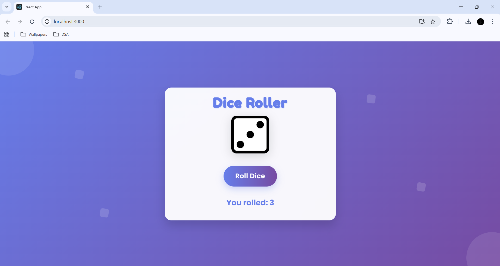
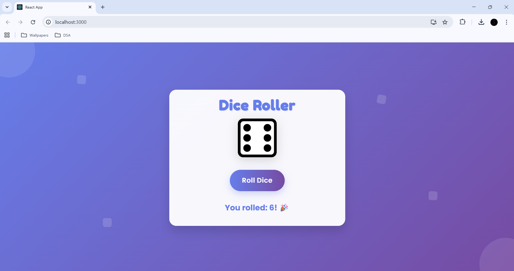

# 🎲 Dice Roller App

A simple and interactive Dice Roller web app built using React.  
Roll the dice with a click and enjoy smooth animations along with a fun celebration when you hit a lucky six 🎉

---

## 📸 Screenshots

### 🎯 Main Interface


### 🎲 Dice Rolling


---

## 🚀 Features

- 🎲 Random dice number generation (1–6)
- ⚡ Smooth rolling animation
- 🎉 Special celebration when the dice lands on 6
- 🖱️ Simple and responsive UI

---

## 🛠️ Tech Stack

- React
- JavaScript
- CSS Animations

---

## Live  Demo

🔗 https://diceroller-app.netlify.app/

---

## 📂 Project Structure

```
dice-roller/
│── public/
│── src/
│── assets/
│── package.json
│── README.md
```

---

## ▶️ Getting Started

1. Clone the repository  

```
git clone https://github.com/salmashaik45/dice-roller.git
```

2. Navigate to the project folder  

```
cd dice-roller
```

3. Install dependencies  

```
npm install
```

4. Run the app  

```
npm start
```

---

## 👩‍💻 Author

**Salma Shaik**  
Computer Science and Engineering Student 

🔗 GitHub: https://github.com/salmashaik45